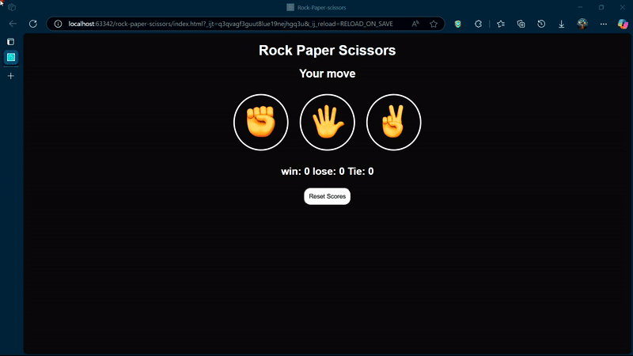

# Rock Paper Scissors Game 🎮

A responsive and interactive **Rock Paper Scissors** web application built with a strong focus on **core functionality** and a clean, modern **UI design**.

## 🌟 Features

- Fully responsive layout — works smoothly on all devices (desktop, tablet, mobile)
- Classic game logic with random computer moves
- Real-time results and score tracking
- Visually appealing UI with smooth transitions
- Clean and organized code structure

## 🛠️ Technologies Used

- HTML5
- CSS3 
- JavaScript (Vanilla)

## 📸 Preview

> 

## 🚀 Getting Started

1. Clone the repo:
   ```bash
   git clone https://github.com/zaynab-emadi/Rock-Paper-Scissors.git


